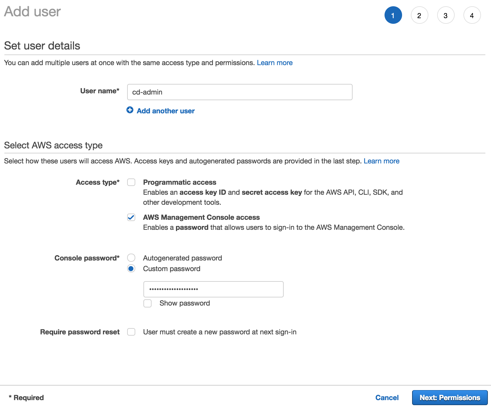
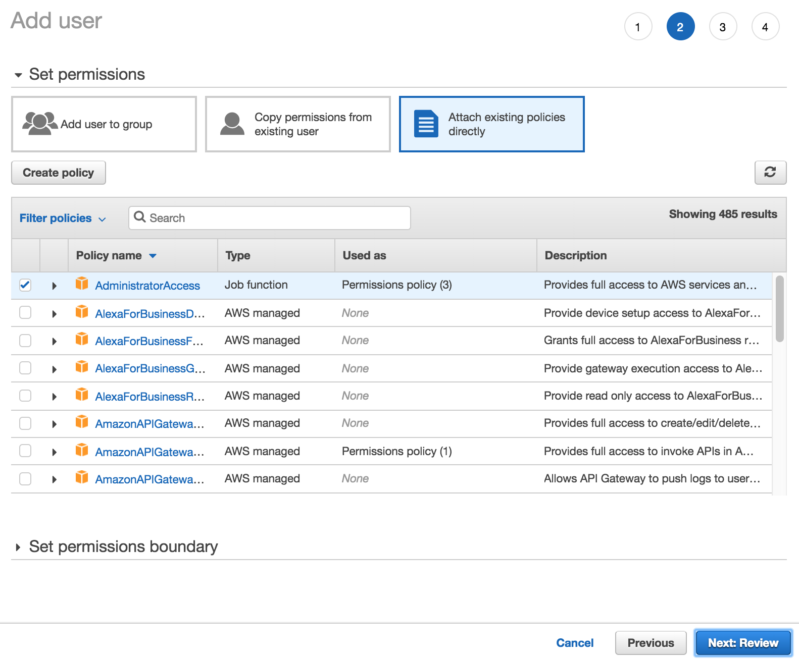

+++
title = "AWS Account and User"
weight = 100
+++

## AWS Account for Experimentation

To deploy our app, you'll need access to an AWS account. If you already have an
account and your system is configured with credentials of an administrator user,
you can [move to the next step](./200-browser.html).

{}
If you are using an existing account, either personal or
a company account, make sure you understand the implications and policy of
provisioning resources into this account.
{}

If you don't have an AWS account, you can [create a free account
here](https://portal.aws.amazon.com/billing/signup).

## Administrator User

2. Sign in to your AWS account
3. Go to the AWS IAM console and [create a new user](https://console.aws.amazon.com/iam/home?#/users$new).
4. Type a name for your user (e.g. `cd-admin`) and choose "AWS Management Console access", pick a password.

    

5. Click **Next: Permissions** to continue to the next step.
6. Click **Attach existing policies directly** and choose **AdministratorAccess**.

    

7. Click **Next: Review**
8. Click **Create User**
9. Click on the **Send email** link to quickly note down the sign-in link which is individual to your account.
