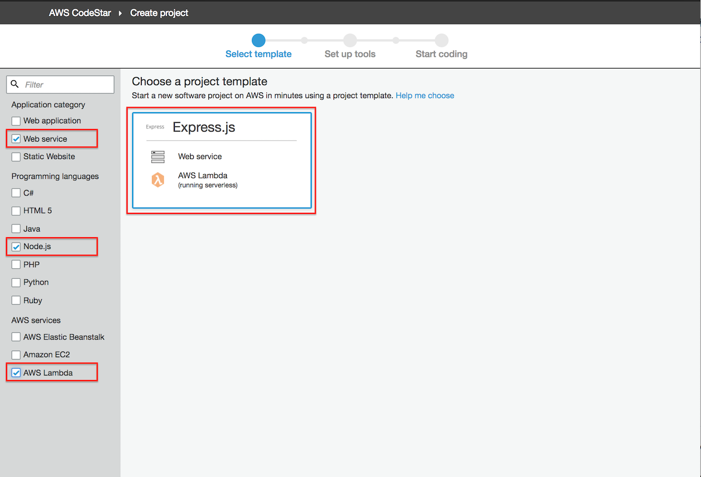
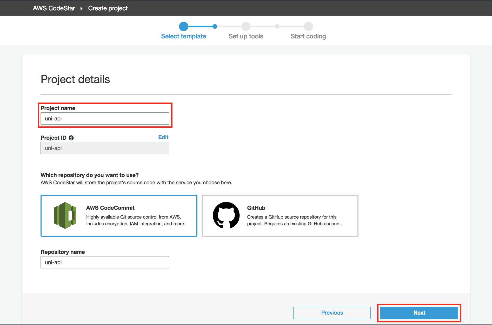
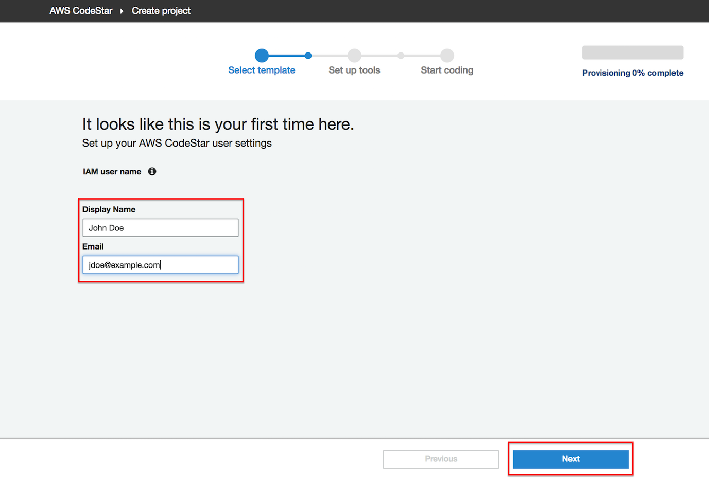
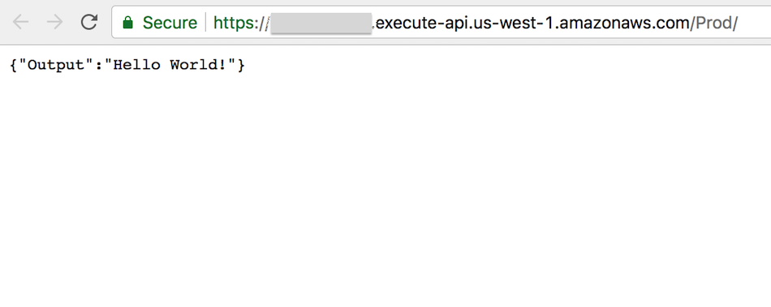
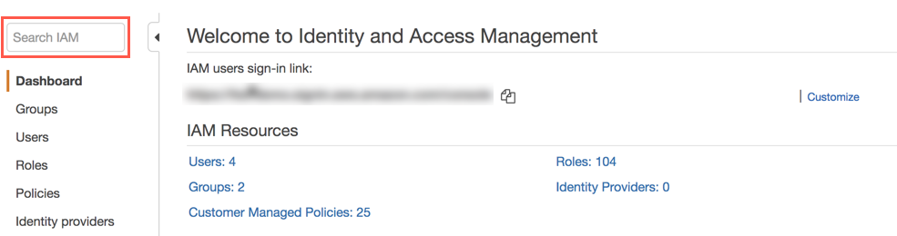

+++
title = "Create AWS CodeStar Project"
weight = 100
+++

In this module you'll use the [AWS CodeStar](https://aws.amazon.com/codestar/) service to create a project that will include:

* An [AWS CodeCommit](https://aws.amazon.com/codecommit/) Git repository, pre-populated with a sample RESTful API written in Node.js
* An [AWS CodeBuild](https://aws.amazon.com/codebuild/) build project
* An [AWS CodePipeline](https://aws.amazon.com/codepipeline/) continuous delivery pipeline

## CodeStar Overview

AWS CodeStar is a cloud-based service for creating, managing, and working with software development projects on AWS. You can quickly develop, build, and deploy applications on AWS with an AWS CodeStar project. An AWS CodeStar project creates and integrates AWS services for your project development toolchain. Depending on your choice of AWS CodeStar project template, that toolchain might include source control, build, deployment, virtual servers or serverless resources, and more.

## Environment Setup

Each of the following sections provide an implementation overview and detailed, step-by-step instructions. The overview should provide enough context for you to complete the implementation if you're already familiar with the AWS Management Console or you want to explore the services yourself without following a walkthrough.

If you're using the latest version of the Chrome, Firefox, or Safari web browsers the step-by-step instructions won't be visible until you expand the section.

## Region Selection

Please use the **Ireland** region for this entire workshop. Make sure you select your region from the dropdown in the upper right corner of the AWS Console before getting started.

## 1. Create a CodeStar project

**Goal**: Use the AWS Console to create a CodeStar project called `uni-api` using the **Node.js Lambda Webservice** template.  Use a web browser to confirm that the API Gateway endpoint created by CodeStar returns the message, `{"Output":"Hello World!"}`, in its response.

<details>
<summary><strong>⬇️ HOW TO create a CodeStar Project (click for details)</strong></summary><p>

1. In the AWS Management Console choose **Services** then select **CodeStar** under Developer Tools.

1. If this is not your first CodeStar project, please skip to step 4 to create a new project.  If this is your first CodeStar project, you will see the CodeStar welcome screen below.  Click the **Start a project** button to get started.

    

1. If this is your first CodeStar project, you will be prompted to confirm that you are granting CodeStar permission to create other AWS resources on your behalf, such as CodeCommit repositories, CodePipeline pipelines, and CodeBuild projects.  Click **Yes, create role** to proceed.

    

1. If you have previously created CodeStar projects, you will see them listed in the project list.  Click **Create a new project** to proceed.

    

1. To narrow the choices for CodeStar projects, select **Web service**, **Node.js**, and **AWS Lambda** in the left navigation.  This should narrow the project options to the **Express.js** web service project, using AWS Lambda.  Select this box to proceed.

    

1. Type `uni-api` as the **Project name**, select **AWS CodeCommit** as the repository, and click the **Next** button in the lower right corner of the browser window to proceed.

    

1. Cick the **Create Project** button in the lower right corner of the browser window to proceed.

    

1. Your IAM user name (not pictured below) will be displayed.  Type a user **Display Name** and **Email** in the according text boxes and click the **Next** button in the lower right corner of the browser window to proceed.

    

1. The next screen asks how you will edit your project code.  Select AWS Cloud9 as the IDE to connect your project to.

    

1. You now can select some details for your Cloud9 environment.  PLease select the **t2.micro** instance type to run your IDE as it is the most cost-effective one.  Leave everything else with the default values.

    

1. The screen below is your CodeStar project dashboard.  After creating a new project, there will be a short delay as CodeStar provisions the resources for CodeCommit, CodeBuild, CodePipeline, Cloud9, and additional resources related to your project template, Lambda functions in this case.  When the progress bar in the upper right of the browser window reaches 100% complete, the provisioning phase of project creation is complete.

    

1. Once provisioning is complete, there will be a brief delay as the CodePipeline pipeline executes for the first time.  The pipeline consists of three stages:

    * Source stage: source code is copied from the CodeCommit repository
    * Build stage: a CodeBuild project executes the commands defined in the project's buildspec.yml to compile the source code into a deployable artifact, in this case a Serverless Application Model (SAM) artifact.
    * Deploy stage: CloudFormation is used to deploy the SAM artifact, representing Lambda functions and an API Gateway environment.

    When these stages are complete, an API Gateway **Application endpoint** will appear in the dashboard.

    

1. Open the **Application endpoint** in a browser window and confirm the response message to read `{"Output":"Hello World!"}`

    

</p></details>
<p>

Congratulations!  You have successfully create a serverless web service project using CodeStar. Now you can launch your Cloud9 IDE. In the upper right corner of the AWS CodeStar dashboard you can find a link to your AWS Cloud9 environments ("See my environments"). Click on "Open IDE" for the environment that has the name of your AWS CodeStar project. You will notice that after it opens in your browser, it will automatically have your GIT repo cloned.

## 2. Update CodeStarWorker-uni-api-CloudFormation IAM Role

1. In the AWS Management Console, click Services then select IAM under Security, Identity, & Compliance.

1. Click the **Search IAM** search box.

    

1. Type `CodeStarWorker-uni-api-CloudFormation` in the search box and select **CodeStarWorker-uni-api-CloudFormation** in the left navigation.

    

1. In the IAM Role Summary page, click the **Attach policies** button.

    

1. Type `AWSLambdaFullAccess AWSCodeDeployFullAccess` in the filter text box, select the checkboxes to the left of the **AWSLambdaFullAccess** and **AWSCodeDeployFullAccess** IAM Role, and click **Attach policy**.

    

1. Upon returning to the IAM Role Summary page, note that the policies have been added to the Role.

    

## 3. Bonus: Modify the API resource implementation

You can now play with your source code: Change the "Hello World!" response into something else (see `/uni-api/uni-api/app.js`), and push your changes into your GIT repo. Then go back to your CodeStar project console and watch the build pipeline in action.

```bash
cd uni-api/
git add -u .
git commit -m "Changed the resource representation"
git push origin
```

## Completion

You have successfully created a CodeStar project and tested the sample REST API.
