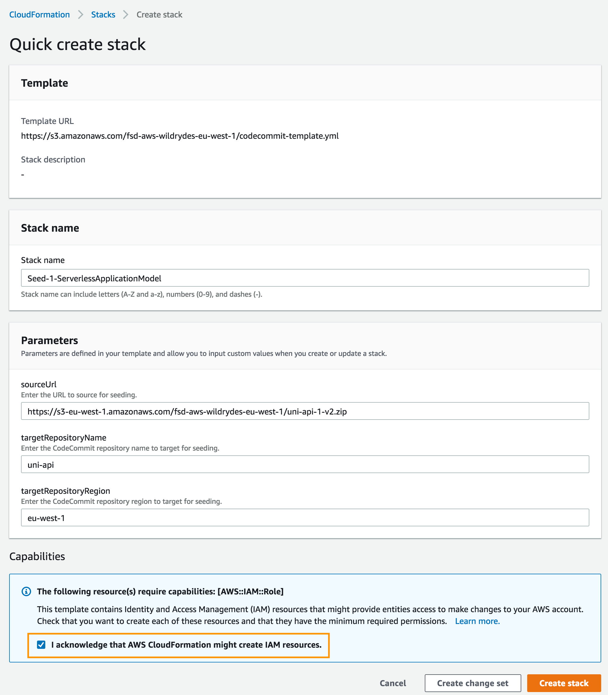
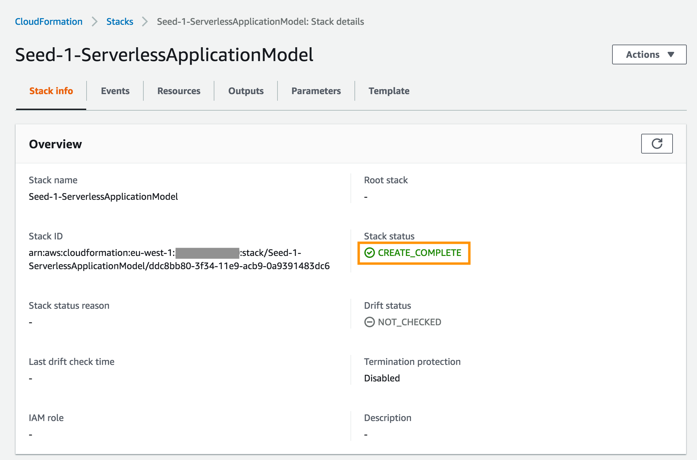
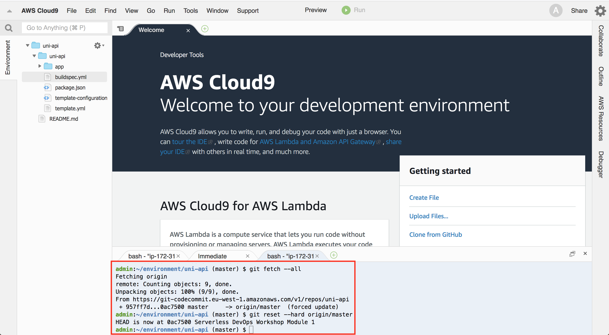
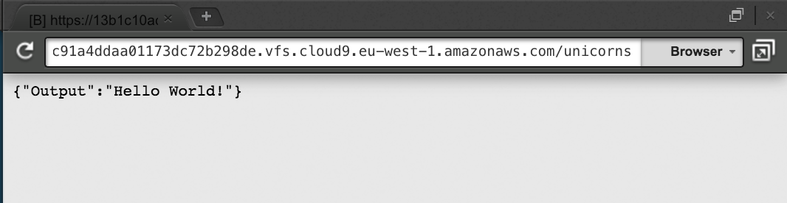

+++
title = "AWS Serverless Application Model"
weight = 100
+++

In this module you'll learn about the [Serverless Application Model (SAM)](https://github.com/awslabs/serverless-application-model) and how you can use it to define a serverless RESTful API.  You will also use [SAM CLI](https://github.com/awslabs/aws-sam-cli) to locally develop and rapidly test an API.

## Serverless Application Model (SAM) Overview

AWS SAM is a model used to define serverless applications on AWS.

Serverless applications are applications composed of functions triggered by events. A typical serverless application consists of one or more AWS Lambda functions triggered by events such as object uploads to Amazon S3, Amazon SNS notifications, and API actions. Those functions can stand alone or leverage other resources such as Amazon DynamoDB tables or S3 buckets. The most basic serverless application is simply a function.

AWS SAM is based on [AWS CloudFormation](https://aws.amazon.com/cloudformation/). A serverless application is defined in a [CloudFormation template](http://docs.aws.amazon.com/AWSCloudFormation/latest/UserGuide/gettingstarted.templatebasics.html) and deployed as a [CloudFormation stack](http://docs.aws.amazon.com/AWSCloudFormation/latest/UserGuide/updating.stacks.walkthrough.html). An AWS SAM template is a CloudFormation template.

AWS SAM defines a set of resources that describe common components of serverless applications.  In order to include objects defined by AWS SAM within a CloudFormation template, the template must include a `Transform` section in the document root with a value of `AWS::Serverless-2016-10-31`.

The Unicorn API includes Amazon API Gateway HTTP endpoints that trigger AWS Lambda functions that read and write data to an Amazon DynamoDB database.  The SAM template for the Unicorn API describes a DynamoDB table with a hash key and Lambda functions to list, view and update Unicorns in the Wild Rydes stable.

In this module, you will be working with a Lambda function that simply displays a welcome message.  The Unicorn API components are defined in the `template.yml` SAM template.  Next we'll review the Lambda function component in more detail.

### AWS::Serverless::Function

Below is a code snippet from the SAM template to list Unicorns:

```yaml
  ListFunction:
    Type: 'AWS::Serverless::Function'
    Properties:
      FunctionName: 'uni-api-list'
      Runtime: nodejs8.10
      CodeUri: app
      Handler: list.lambda_handler
      Description: List Unicorns
      Timeout: 10
      Events:
        GET:
          Type: Api
          Properties:
            Path: /unicorns
            Method: get
      Role:
        Fn::ImportValue:
          !Join ['-', [!Ref 'ProjectId', !Ref 'AWS::Region', 'LambdaTrustRole']]
```

There are several [properties](https://github.com/awslabs/serverless-application-model/blob/master/versions/2016-10-31.md#properties) defined for the [AWS::Serverless::Function](https://github.com/awslabs/serverless-application-model/blob/master/versions/2016-10-31.md#awsserverlessfunction) resource, which we'll review in turn.

#### FunctionName

The **FunctionName** property defines a custom name for the Lambda function.  If not specified, CloudFormation will generate a name using the CloudFormation Stack name, CloudFormation Resource name, and random ID.

#### Runtime

The example API shown above is implemented in **Node.js 8.10**.  Additional runtimes are available for AWS Lambda.  Please refer to the [Lambda Execution Environment and Available Libraries](http://docs.aws.amazon.com/lambda/latest/dg/current-supported-versions.html) for the complete list.

#### CodeUri

The **CodeUri** property defines the location to the function code on your workstation relative to the SAM template.  In this example, "**app**" is used for the property value because the function code is in the `app` directory relative to the SAM template.

#### Handler

The **Handler** property defines the entry point for the Lambda function.  For Javascript, This is formatted as "**file**.**function**", where **file** is the Javascript filename without the ".js" extension relative to the **CodeUri** path defined above and **function** is the name of the function in the file that will be executed with the Lambda function is invoked.

#### Events

The **Events** property defines the sources that trigger the Lambda function invocation.  An [Api](https://github.com/awslabs/serverless-application-model/blob/master/versions/2016-10-31.md#api) event source is defined to integrate the Lambda function with an API Gateway endpoint, however SAM supports Lamdba function triggers from a variety of [sources](https://github.com/awslabs/serverless-application-model/blob/master/versions/2016-10-31.md#event-source-types).

The **Api** event source to view details of a Unicorn is defined at the RESTful resource `/unicorns/{name}` accessed using the HTTP GET method.  SAM will transform the Api event to an API Gateway resource and map the **name** value in the URL to a [pathParameter](http://docs.aws.amazon.com/apigateway/latest/developerguide/getting-started-mappings.html) in the event used to invoke the Lambda function.

#### Role

The **Role** property defines the IAM Role that specifies the access permissions to AWS resources in the [Lambda execution policy](http://docs.aws.amazon.com/lambda/latest/dg/intro-permission-model.html#lambda-intro-execution-role).  For each project, CodeStar generates a Lambda execution role that has access to a default set of AWS resources.  This role can be modified with additional policies.

## Environment Setup

Each of the following sections provide an implementation overview and detailed, step-by-step instructions. The overview should provide enough context for you to complete the implementation if you're already familiar with the AWS Management Console or you want to explore the services yourself without following a walkthrough.

If you're using the latest version of the Chrome, Firefox, or Safari web browsers the step-by-step instructions won't be visible until you expand the section.


### 1. Seed the `uni-api` CodeCommit Git repository

1. Each module has corresponding source code used to seed the CodeCommit Git repository for the CodeStar project.  To seed the CodeCommit Git repository, click on the **Launch Stack** button for your AWS region below:

    Region| Launch
    ------|-----
    EU (Ireland) | [](https://console.aws.amazon.com/cloudformation/home?region=eu-west-1#/stacks/create/review?stackName=Seed-1-ServerlessApplicationModel&templateURL=https://s3.amazonaws.com/fsd-aws-wildrydes-eu-west-1/codecommit-template.yml&param_sourceUrl=https://demo-dub.s3-eu-west-1.amazonaws.com/cdonaws/uni-api-1-v5.zip&param_targetRepositoryName=uni-api&param_targetRepositoryRegion=eu-west-1)

1. The CloudFormation template has been prepopulated with the necessary fields for this module. No changes are necessary.

1. Select the **I acknowledge that AWS CloudFormation might create IAM resources.** checkbox to grant CloudFormation permission to create IAM resources on your behalf

1. Click the **Create** button in the lower right corner of the browser window to create the CloudFormation stack and seed the CodeCommit repository.

    

1. There will be a short delay as the Git repository is seeded with the new source code.  Upon successful completion, the CloudFormation will show Status ``CREATE_COMPLETE``.

    

### 2. Fetch CodeCommit Git Repository

Now that the CodeCommit Git repository has been seeded with new source code, you will need to fetch the changes locally so that you may modify the code.  Typically, this is accomplished using the `git pull` command, however for the workshop we have replaced the repository with a new history and different Git commands will be used.

Go back to the Cloud9 tab in your browser and run the following commands in a terminal tab in your local `uni-api` Git repository:

```bash
git fetch --all
git reset --hard origin/master
git clean -fd
```



After the Git reset to the Seed, the commit message should reflect the module/ lab name.

It may be required to refresh the local file tree in your Cloud9 IDE to have it reflect the updated code repository. If you have any file open in an editor tab that has disappeared due to the repository update, you will be prompted if Cloud9 should close the tab or not (you can close the tab).


### 3. Bonus: Create a new API resource

Add a new Lambda function with its respective API resource to your SAM template and provide the implementation.


## AWS SAM CLI

[AWS SAM CLI](https://docs.aws.amazon.com/lambda/latest/dg/test-sam-cli.html) is the AWS SAM CLI tool for managing Serverless applications written with the support of the [Serverless Application Model (SAM)](https://github.com/awslabs/serverless-application-model). AWS SAM CLI can be used to test functions locally, start a local API Gateway from a SAM template, validate a SAM template, and generate sample payloads for various event sources.  

### Installation

Your Cloud9 instance comes already with SAM CLI installed. However, it may have an outdated version that you may want to upgrade first. You can run the following commands in a terminal tab in your Cloud9 IDE, as you did above with the Git commands.

#### Updating AWS SAM on AWS Cloud9

1. Update `pip` to the latest version:

    ```bash
    $ sudo pip install --upgrade pip
    ```

1. Close the terminal tab and open a new one (see _Window->New Terminal_ in the main menu).

1. Update AWS SAM CLI and check the version

    ```bash
    $ pip install --user aws-sam-cli --upgrade
    $ sam --version
    SAM CLI, version 0.15.0
    ```

## SAM CLI Development

In this section, you will use SAM CLI on your workstation to run the Unicorn API and test changes to it without having to deploy to AWS.

### Run API Gateway locally

1. From the **`uni-api`** directory, run the following command in a terminal tab in Cloud9:

    ```bash
    ~/environment/uni-api (master) $ sam local start-api -p 8080
    ```
   
    If this is your first time running SAM CLI, there will be a delay as the Docker images are downloaded.  Once successful, you should see output similar to the one below:

    
~/environment/uni-api (master) $ sam local start-api -p 8080
2019-03-05 14:49:15 Found credentials in shared credentials file: ~/.aws/credentials
2019-03-05 14:49:15 Mounting ListFunction at http://127.0.0.1:8080/unicorns [GET]
2019-03-05 14:49:15 You can now browse to the above endpoints to invoke your functions. You do not need to restart/reload SAM CLI while working on your functions, changes will be reflected instantly/automatically. You only need to restart SAM CLI if you update your AWS SAM template
2019-03-05 14:49:15  * Running on http://127.0.0.1:8080/ (Press CTRL+C to quit)
    

1. Open another terminal tab in Cloud9 and enter `curl -i http://127.0.0.1:8080/unicorns` at the prompt. Confirm that you see the output below:

    
$ curl -i http://127.0.0.1:8080/unicorns
HTTP/1.0 200 OK
Content-Type: application/json
Content-Length: 25
Server: Werkzeug/0.14.1 Python/2.7.15
Date: Tue, 05 Mar 2019 14:50:18 GMT

{"Output":"Hello World!"}
    

1. Inbound communication is not allowed on port 8080 and the service is only exposed at 127.0.0.1, that's why you cannot access and test the application in your browser directly. AWS Cloud9 provides a Virtual File System (VFS) stream to your browser to test the application via HTTP:

    To preview the application, click on _Preview->Preview Running Application_ in the top menu. An additional browser frame will appear that allows you to **append** `/unicorns` to the end of the URL. The result should look like this:

    

Congratulations!  You have successfully used SAM CLI to start a local development environment.  Keep the window open that is running the `start-api` command until this module is complete.

Next, let's look at how you can use SAM CLI to test changes to your API.

### Test code changes locally

**Goal**: Update `app/list.js` to change the welcome message to `Hello workshop!`.  Remember, the local API Gateway supports hot-reloading of code changes.  There is no need to restart the `start-api` process to see changes.

<details>
<summary><strong>⬇️ HOW TO update code and verify results (click for details)</strong></summary>

1. Open `app/list.js` in your Cloud9 editor, update the message to read `Hello workshop!`, and save the changes.

    
'use strict';

const AWS = require('aws-sdk');

exports.lambda_handler = (event, context, callback) => {
  console.log('Received event:', JSON.stringify(event, null, 2));

  var message = "Hello workshop!";

  callback(null, {
    statusCode: 200,
    body: JSON.stringify({
      Output: message
    })
  });
};
    

1. Run the `curl -i http://127.0.0.1:8080/unicorns` command above once more in a terminal tab in Cloud9 and confirm that you see the output below (or refresh the preview pane):

    ```bash
    $ curl -i http://127.0.0.1:8080/unicorns
    HTTP/1.0 200 OK
    Content-Type: application/json
    Content-Length: 28
    Server: Werkzeug/0.14.1 Python/2.7.15
    Date: Tue, 05 Mar 2019 15:59:38 GMT

    {"Output":"Hello workshop!"}
    ```
    
</details>
<p>

Congratulations!  You've successfully test changes to a Lambda function in a local development environment. You may now kill the SAM CLI running process.

To learn more about development with SAM CLI, check out [AWS Documentation](https://docs.aws.amazon.com/serverless-application-model/latest/developerguide/serverless-sam-cli-command-reference.html) and SAM CLI [GitHub repository](https://github.com/awslabs/aws-sam-cli).

## Completion

You have successfully performed local development and testing of a RESTful serverless API using the Serverless Application Model. Please stop the `sam local start-api` command (shortcut CTRL-C) in the terminal before proceeding with the next module. If for any reason, the command is running in the background, you can find and stop the process as on any other linux machine by:

```bash
$ ps aux | grep -v grep | grep sam
ec2-user 21200  8.6  5.0 295132 50636 pts/7    S+   16:26   0:00 /usr/bin/python2.7 /usr/local/bin/sam local start-api -p 8080
$ kill 21200
```
