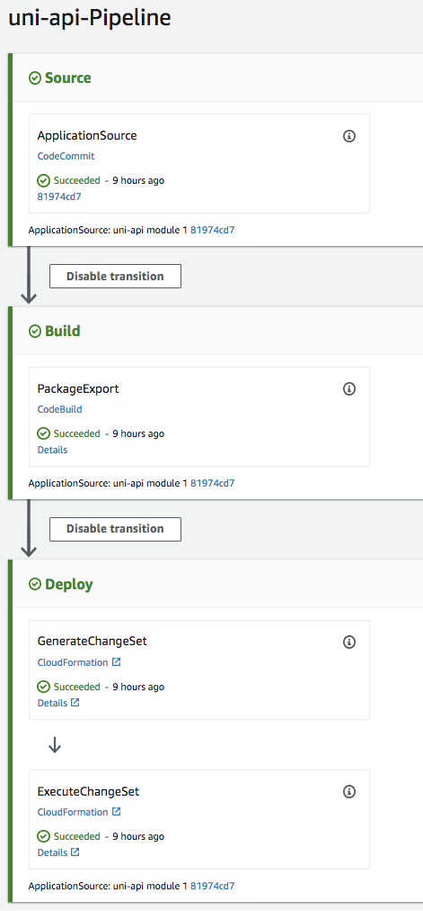

+++
title = "Overview"
weight = 100
+++

In this module, you'll use [AWS CodePipeline](https://aws.amazon.com/codepipeline/), [AWS CodeBuild](https://aws.amazon.com/codebuild/), and [Amazon S3](https://aws.amazon.com/s3/) to build a Continuous Delivery pipeline to automate a code deployment workflow for the Unicorn API.

## CodePipeline Overview

CodePipeline orchestrates the steps to build, test, and deploy your code changes.  Below is a screenshot of the CodePipeline created by the CodeStar project.



## CodeBuild Overview

CodeBuild compiles source code, runs tests, and produces software packages that are ready to deploy to environments.

The Unicorn API `buildspec.yml` defines the commands used to build the project and the output artifacts.

```yaml
version: 0.1

phases:
  pre_build:
    commands:
      # Discover and run unit tests in the 'tests' directory
      - npm test
      # Only package production dependencies into final artifact
      - rm -rf node_modules && npm install --production*
  build:
    commands:
      - cd app && npm install
      - aws cloudformation package --template template.yml --s3-bucket $S3_BUCKET --output-template template-export.yml

artifacts:
  type: zip
  files:
    - template-export.yml
```

The **CloudFormation [package](http://docs.aws.amazon.com/cli/latest/reference/cloudformation/package.html)** command zips the local source code, uploads it to S3, and returns a new CloudFormation template that has been modified to use the S3 references as the CodeUri.

For the Unicorn API, the output artifact is a zip archive that includes only the `template-export.yml` file.
