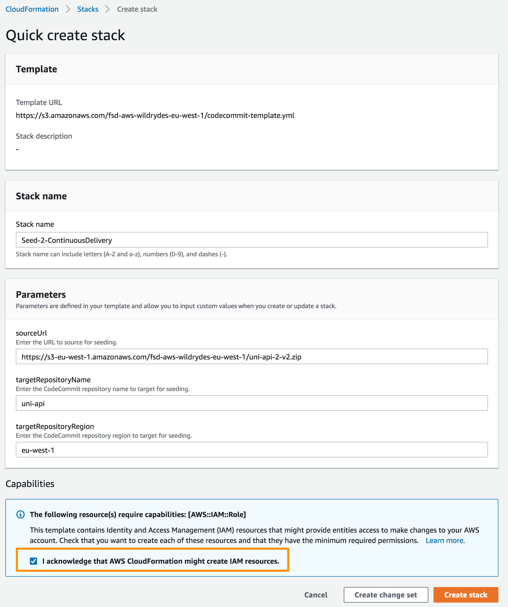
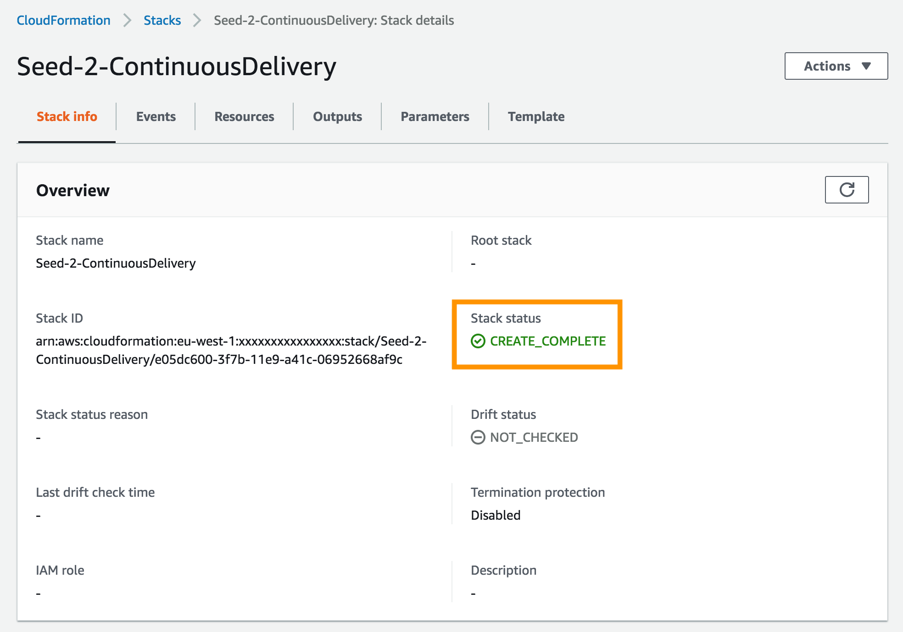
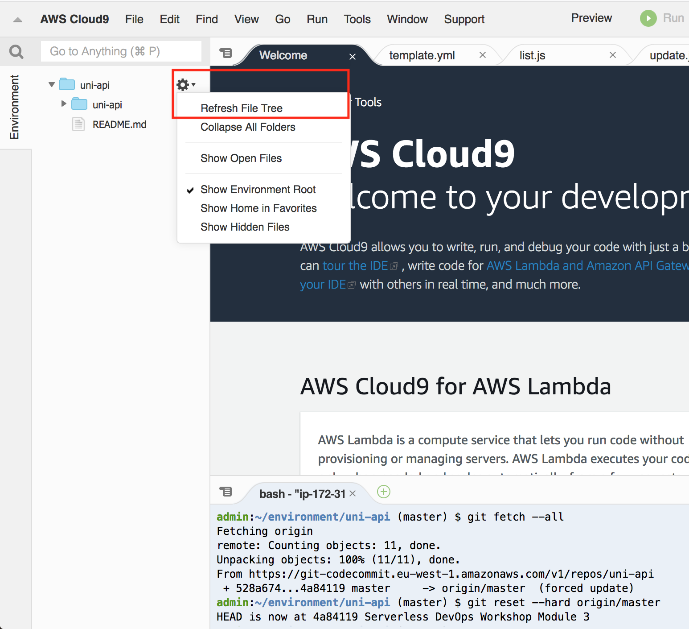

+++
title = "Environment setup"
weight = 101
+++

Each of the following sections provide an implementation overview and detailed, step-by-step instructions. The overview should provide enough context for you to complete the implementation if you're already familiar with the AWS Management Console or you want to explore the services yourself without following a walkthrough.

If you're using the latest version of the Chrome, Firefox, or Safari web browsers the step-by-step instructions won't be visible until you expand the section.

### 1. Seed the `uni-api` CodeCommit Git repository

1. Each module has corresponding source code used to seed the CodeStar CodeCommit Git repository to support the workshop.  To seed the CodeCommit Git repository, click on the **Launch Stack** button for your region below:

    Region| Launch
    ------|-----
    EU (Ireland) | [](https://console.aws.amazon.com/cloudformation/home?region=eu-west-1#/stacks/create/review?stackName=Seed-2-ContinuousDelivery&templateURL=https://s3.amazonaws.com/fsd-aws-wildrydes-eu-west-1/codecommit-template.yml&param_sourceUrl=https://demo-dub.s3-eu-west-1.amazonaws.com/cdonaws/uni-api-2-v5.zip&param_targetRepositoryName=uni-api&param_targetRepositoryRegion=eu-west-1)

1. The CloudFormation template has been prepopulated with the necessary fields for this module. No changes are necessary.

1. Select the **I acknowledge that AWS CloudFormation might create IAM resources.** checkbox to grant CloudFormation permission to create IAM resources on your behalf

1. Click the **Create stack** button in the lower right corner of the browser window to create the CloudFormation stack and seed the CodeCommit repository.

    

1. There will be a short delay as the Git repository seeded with the new source code.  Upon successful completion, the CloudFormation will show Status ``CREATE_COMPLETE``.

    

### 2. Fetch CodeCommit Git Repository

Now that the CodeCommit Git repository has been seeded with new source code, you will need to fetch the changes locally so that you may modify the code.  Typically, this is accomplished using the `git pull` command, however for the workshop we have replaced the repository with a new history and different Git commands will be used.

Go back to the Cloud9 tab in your browser and run the following commands in a terminal tab in your local `uni-api` Git repository:

```bash
git fetch --all
git reset --hard origin/master
git clean -fd
```


After the Git reset to the Seed, the commit message should reflect the module/ lab name.

It may be required to refresh the local file tree in your Cloud9 IDE to have it reflect the updated code repository. If you have any file open in an editor tab that has disappeared due to the repository update, you will be prompted if Cloud9 should close the tab or not (you can close the tab).

