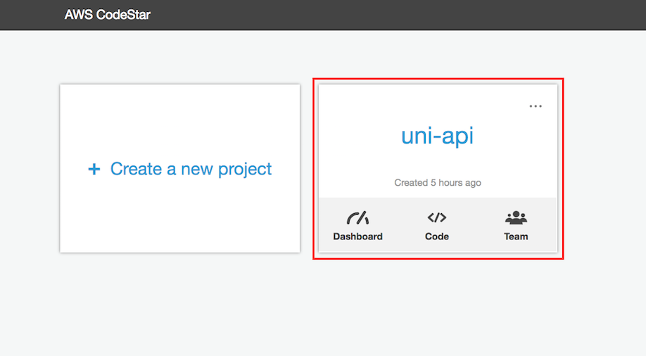
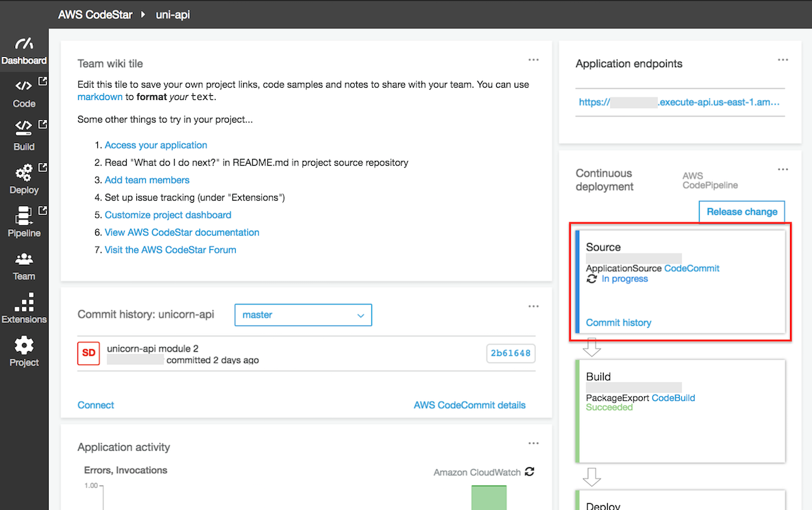

+++
title = "API Enhancement"
weight = 102
+++

Let's enhance the API with the ability to create or update a Unicorn in the Wild Rydes stables.  The code to do so is already present in the project, so you need to add an **AWS::Serverless::Function** resource in the SAM `template.yml` template.

### 1. Add Update Function to template.yml

**Goal**: Using the `AWS::Serverless::Function` definitions in the `template.yml` file as examples, add a new Serverless Function named **uni-api-update** to the `template.yml` SAM template.  The function should invoke the **lambda_handler** method in the **`app/update.js`** file when triggered by an **Api** event to the URL path **/unicorns/{name}** using the HTTP **put** method.  The function will require an environment variable, named **TABLE_NAME** that has a value referring to the `AWS::Serverless::SimpleTable` defined in the template.

#### HOW TO update template.yml with uni-api-update Lambda function

Open the `template.yml` file in your Cloud9 editor and append a new **AWS::Serverless::Function** Resource labeled `UpdateFunction` that has the following definition.

> Note: whitespace is important in YAML files.  Please verify that the configuration below is added with the same space indentation as the CloudFormation Resources in the template.yml file.

1. **FunctionName** is `uni-api-update`

1. **Runtime** is `nodejs8.10`

1. **CodeUri** is `app`

1. **Handler** is `update.lambda_handler`

1. **Description** is `Update a Unicorn`

1. **Timeout** is `10`

1. **Event** type is `Api` associated to the `/unicorns/{name}` **Path** and `put` **Method**

1. **Environment** variable named `TABLE_NAME` that references the `Table` Resource for its value.

1. **Role** is duplicated from another function.

    If you are unsure of the syntax to add to ``template.yml`` please refer to the code snippet below.


    
  UpdateFunction:
    Type: 'AWS::Serverless::Function'
    Properties:
      FunctionName: 'uni-api-update'
      Runtime: nodejs8.10
      CodeUri: app
      Handler: update.lambda_handler
      Description: Update Unicorn
      Timeout: 10
      Events:
        UPDATE:
          Type: Api
          Properties:
            Path: /unicorns/{name}
            Method: put
      Environment:
        Variables:
          TABLE_NAME: !Ref Table
      Role: !GetAtt LambdaExecutionRole.Arn
    

Now that the API is using a DynamoDB table, we need to add permission for the Lambda Function to access it.

### 2. Update LambdaExecutionRole with DynamoDB access

**Goal**: Update the `AWS::IAM::Role` resource named **LambdaExecutionRole** in the `template.yml` SAM template to include the `arn:aws:iam::aws:policy/AmazonDynamoDBFullAccess` policy in the `ManagedPolicyArns` section.

<details>
<summary><strong>⬇️ HOW TO update the LambdaExecutionRole IAM Role in the template.yml with AmazonDynamoDBFullAccess (expand for details)
</strong></summary>
<p>

1. Open the `template.yml` file in your Cloud9 editor and find the **AWS::IAM:Role** Resource labeled `LambdaExecutionRole`.
 
2. Add `arn:aws:iam::aws:policy/AmazonDynamoDBFullAccess` to the list of ManagedPolicyArns.

    If you are unsure of the syntax to add to ``template.yml`` please refer to the code snippet below.

    
  LambdaExecutionRole:
    Description: Creating service role in IAM for AWS Lambda
    Type: AWS::IAM::Role
    Properties:
      RoleName: !Sub 'CodeStar-${ProjectId}-Execution${Stage}'
      AssumeRolePolicyDocument:
        Statement:
        - Effect: Allow
          Principal:
            Service: [lambda.amazonaws.com]
          Action: sts:AssumeRole
      Path: /
      ManagedPolicyArns:
        - arn:aws:iam::aws:policy/service-role/AWSLambdaBasicExecutionRole
        - arn:aws:iam::aws:policy/AmazonDynamoDBFullAccess
      PermissionsBoundary: !Sub 'arn:${AWS::Partition}:iam::${AWS::AccountId}:policy/CodeStar_${ProjectId}_PermissionsBoundary'
    
</details>

<p>

Now that you've updated the the SAM template with the changes, use Git to commit the changes and push them to remote repository.  This will trigger CodePipeline to build and deploy your changes in AWS.

### 3. Commit the change to local Git repository

1. Using a terminal tab in your Cloud9 IDE, add the local changes to the Git index, and commit with a message.

    ```bash
    git add -u
    git commit -m "Add update function"
    ```

1. Using a terminal tab in your Cloud9 IDE, push the Git repository updates to the origin.

    ```bash
    git push origin
    ```

### 4. Confirm CodePipeline Completion

**Goal**: After pushing your changes to your CodeCommit Git repository, use the AWS CodeStar Console to monitor and confirm that the changes are successfully built and deployed using CodePipeline.

#### HOW TO use the CodeStar Console to monitor CodePipeline

1. In the AWS Management Console choose **Services** then select **CodeStar** under Developer Tools.

1. Select the `uni-api` project

    

1. Observe that the continuous deployment pipeline on the right of the browser window now shows the Source stage to be blue, meaning that it is active.

    

1. Each stage's color will turn blue during execution and green on completion.  Following the successful execution of all stages, the pipeline should look like the following screenshot.

    

Congratulations, your changes were successfully built and deployed using CodePipeline.  Next, let's validate that you're able to use the API to add a Unicorn to the Wild Rydes Stable.