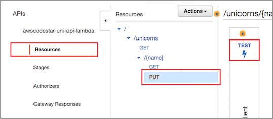
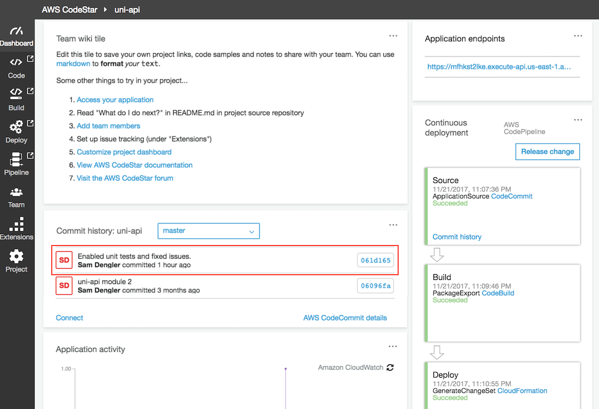
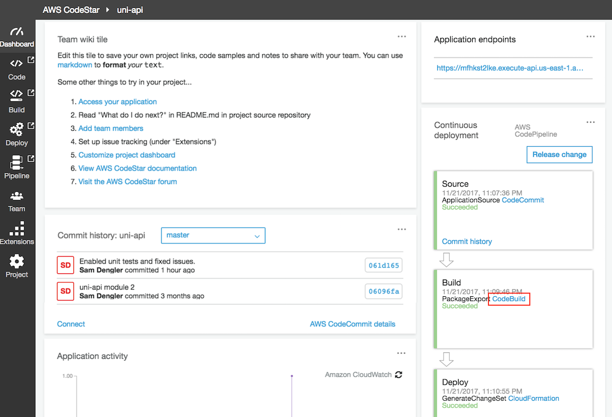

+++
title = "Enhancement Validation"
weight = 103
+++

After the CloudFormation deploy command completes, you will use the AWS API Gateway to test your API.

### 1. Add a Unicorn

1. In the AWS Management Console, click **Services** then select **API Gateway** under Application Services.

1. In the left nav, click on `awscodestar-uni-api-lambda`.

1. From the list of API resources, click on the `PUT` link under the `/{name}` resource.

1. On the resource details panel, click the `TEST` link in the client box on the left side of the panel.

    

1. On the test page, enter `Shadowfax` in the **Path** field.

1. Scroll down the test page and enter the following as the **Request Body**:

    ```json
    {
      "breed": "Brown Jersey",
      "description": "Shadowfax joined Wild Rydes after completing a distinguished career in the military, where he toured the world in many critical missions. Shadowfax enjoys impressing his ryders with magic tricks that he learned from his previous owner."
    }
    ```

    

1. Scroll down and click the **Test** button.

1. Scroll to the top of the test page, and verify that on the right side of the panel that the **Status** code of the HTTP response is 200.

    

Congratulations, you have used the API to successfully add a Unicorn!  Next, use the API to list the Unicorns and confirm Shadowfax is included.

### 2. List Unicorns

1. In the AWS Management Console choose **Services** then select **CodeStar** under Developer Tools.

1. Select the `uni-api` project

    

1. Copy the URL from the **Application endpoints** tile on the right side of the dashboard.

    

1. Paste the URL in a browser window and append `/unicorns` to the path and hit enter.  For example: `https://xxxxxxxxxx.execute-api.us-east-1.amazonaws.com/Prod/unicorns/`

1. Confirm that the browser shows a JSON result that includes `Shadowfax`, with the breed and description entered above.


## Unit Testing our API

Now that we have a working API, let's consider what steps we can take to ensure that we prevent bugs from creeping into our code.  As you can see, manual testing of our API has a couple of issues; we have to wait for the build process to complete and it takes a human being to go through the steps to verify the API works using the API Gateway service. It would be faster and more reliable to have an automated process that can perform this verification, and it would be even better to have these checks integrated into our build processes.

The repository you cloned in the steps above already include a set of tests that verify the functionality of our Lambda functions, so we won't need to write them from scratch. In the below steps, we will install the tools necessary to execute these tests, fix an issue that we discover has crept into our code, and take steps to ensure these issues won't crop up again in the future.

### 1. Install the testing tools and run our unit test 

1. Go to a terminal tab in your Cloud9 IDE and change the directory to your local **uni-api** directory, if you aren't already there.

1. Install the development tools needed to run unit tests using Node Package Manager:

    ```
    npm install
    ```

1. Since the code for this project was written in Nodejs, we're using the Mocha test framework (https://mochajs.org/). This was already registered in our `package.json` file, so it was installed automatically in the previous step. Now that the tools have been installed, let's run Mocha, our unit testing tool.

    Our suite of tests will run with the `mocha` command, and we will discover that there's an issue in our code! One of our Lambda functions is not returning the correct response when we attempt to read a non-existent unicorn's data.
    
    
~/environment/uni-api (master) $ node_modules/.bin/mocha

[...]

  4 passing (28ms)
  1 failing

  1) Reading Unicorns
       errors on missing unicorn data:

      AssertionError: 500 == 404
      + expected - actual

      -500
      +404
      
      at lambda.lambda_handler (test/read.spec.js:77:20)
      at app/read.js:20:10
      at Object.get (test/read.spec.js:34:33)
      at Object.exports.lambda_handler (app/read.js:18:13)
      at Context.<anonymous> (test/read.spec.js:65:16)
    


### 2. Fix unit test failures

Let's examine the output of our test run. We see that the test expected that we would return the standard "404" error code if we attempted to read a unicorn that did not exist in the system, and instead our Lambda code returns a "500."

**Goal**: Correct code bug in `app/read.js`, run unit tests, and verify the tests pass.

#### HOW TO correct code bug and verify passing unit test

1. Open `app/read.js` in your Cloud9 editor and navigate to the end where we construct our response. We will see that, where we specify the status code to return, we use the existence of a retured item to determine whether we return a 200 (OK) or a 500 (server error) code.

1. Change the code to return a 404 (resource not found) status code instead of a 500.

    
var build_response = function(data) {
  if (data.Item) {
    return {
      statusCode: 200,
      body: JSON.stringify(data.Item)
    };
  } else {
    return {
      statusCode: 404,
      body: JSON.stringify({})
    };
  }
};
    

1. Now that we have fixed our code, let's verify the behavior by re-running our unit testing tool:

    
~/environment/uni-api (master) $ node_modules/.bin/mocha

[...]

  5 passing (23ms)
    

Congratuations, you've successfully corrected the code bug!  Next, let's look at how to run these tests as part of CodePipeline.


### 3. Ensure our tests are run during our builds

Having this testing framework in place ensures that the exact same set of steps are run every time we test our code. However, we are still running this test manually. Let's configure our CodeBuild environment to run these tests for us every time a build is performed.

1. Open `buildspec.yml` in your Cloud9 editor and navigate to the `pre_build:` section. 

1. We have discovered that our nemesis, Chet, has disabled our unit tests! Why, Chet, why?! To fix this, uncomment the line that executes the `mocha` command so our unit tests will be run during the build.

1. Go to a terminal tab in your Cloud9 IDE and add the local changes to the Git index, commit these changes with a message, and push our local changes to the repository. For example:

    ```bash
    git add -u
    git commit -m "Enabled unit tests and fixed issues"
    git push
    ```
    
### 4. Verify the tests are run during the build

1. In the AWS Management Console choose **Services** then select **CodeStar** under Developer Tools.

1. Select the `uni-api` project

    

1. Scroll down to the "Commit history" tile and verify that you see the commit message that you entered above, for example "Enabled unit tests and fixed issues".

    

1. Monitor the "Continuous Deployment" pipeline to ensure that the most recent execution of the Build step took place after you committed the code in the steps above. If you have just committed your changes it may take a few minutes for your changes to be detected and executed.

1. Once the Build step has completed, click the `Build` link inside the step to view the CodeBuild project and build history.

    

1. Scroll down to the "Build History" section, and click the entry for the most recent build to view the details of the build.

    

1. Scroll down to the Build logs section, and inspect the build log, looking for a section that begins with `Running command mocha` and reports the results of the test pass (should be `5 passing`).

    

Congratulations, you have successfully integrated unit tests into your continuous delivery process!
