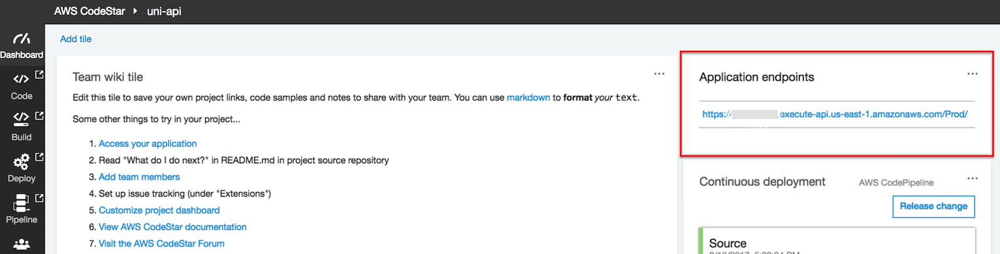

+++
title = "Environment Setup"
weight = 100
+++


#### Enable Active Tracing on Lambda Functions

Each Lambda Function must be enabled for active tracing for X-Ray by adding a `Tracing` property with a value of `Active` ([see more](https://github.com/awslabs/serverless-application-model/blob/master/versions/2016-10-31.md#properties)).


#### Integrate AWS X-Ray SDK with Lambda Function

To integrate the X-Ray SDK into the Node.js Unicorn API, the [aws-xray-sdk](https://www.npmjs.com/package/aws-xray-sdk) node module is added as a project dependency using [npm](https://www.npmjs.com/).  This has already been included in the [package.json](uni-api/package.json) file in the `uni-api/app` directory, and will be included in the project during the CodeBuild stage of the pipeline.

With the addition of the [aws-xray-sdk](https://www.npmjs.com/package/aws-xray-sdk) library to the project, the library needs to be integrated into the application code.  Below are the Lambda function initialization code snippets before and after the X-Ray integration.

Before:

```javascript
const AWS = require('aws-sdk');
const docClient = new AWS.DynamoDB.DocumentClient();
const tableName = process.env.TABLE_NAME;
```

After:

```javascript
const AWSXRay = require('aws-xray-sdk');
const AWS = AWSXRay.captureAWS(require('aws-sdk'));
const docClient = new AWS.DynamoDB.DocumentClient();
const tableName = process.env.TABLE_NAME;
```

As you can see, the basic X-Ray integration into Lambda requires only two changes.  One new line of code to include the `aws-xray-sdk`, and a second modification to wrap the `aws-sdk` library with X-Ray.  This causes all the AWS API calls to be wrapped by X-Ray for instrumentation without having to change the code further.

**Now on to the work at hand...**


## Environment Setup

In order to tackle [Problem 1: Error Discovery Using X-Ray]() and [Problem 2: Performance Discovery Using-X-Ray](), you must clone a seed the project repository using the steps below.

### 1. Seed the `uni-api` CodeCommit Git repository

1. Each module has corresponding source code used to seed the CodeStar CodeCommit Git repository to support the workshop.  To seed the CodeCommit Git repository, click on the **Launch Stack** button for your region below:

    Region| Launch
    ------|-----
    EU (Ireland) | [](https://console.aws.amazon.com/cloudformation/home?region=eu-west-1#/stacks/create/review?stackName=Seed-3-XRay&templateURL=https://s3.amazonaws.com/fsd-aws-wildrydes-eu-west-1/codestar-template.yml&param_sourceUrl=https://demo-dub.s3-eu-west-1.amazonaws.com/cdonaws/uni-api-3-v5.zip&param_targetProjectId=uni-api&param_targetProjectRegion=eu-west-1)

1. The CloudFormation template has been prepopulated with the necessary fields for this module. No changes are necessary.

1. Select the **I acknowledge that AWS CloudFormation might create IAM resources.** checkbox to grant CloudFormation permission to create IAM resources on your behalf

1. Click the **Create stack** button in the lower right corner of the browser window to create the CloudFormation stack and seed the CodeCommit repository.

    

1. There will be a short delay as the Git repository seeded with the new source code.  Upon successful completion, the CloudFormation will show Status ``CREATE_COMPLETE``.

    

### 2. Fetch CodeCommit Git Repository

Now that the CodeCommit Git repository has been seeded with new source code, you will need to fetch the changes locally so that you may modify the code.  Typically, this is accomplished using the `git pull` command, however for the workshop we have replaced the repository with a new history and different Git commands will be used.

Go back to the Cloud9 tab in your browser and run the following commands in a terminal tab in your local `uni-api` Git repository:

```bash
git fetch --all
git reset --hard origin/master
git clean -fd
```


After the Git reset to the Seed, the commit message should reflect the module/ lab name.

It may be required to refresh the local file tree in your Cloud9 IDE to have it reflect the updated code repository. If you have any file open in an editor tab that has disappeared due to the repository update, you will be prompted if Cloud9 should close the tab or not (you can close the tab).


**Note:** For the Lambda Function to access the X-Ray Service, the **LambdaExecutionPolicy** must include the **arn:aws:iam::aws:policy/AWSXRayDaemonWriteAccess** Managed Policy.  For simplification, this policy has been added to the **template.yml** file, which will now look like the following:


  LambdaExecutionRole:
    Description: Creating service role in IAM for AWS Lambda
    Type: AWS::IAM::Role
    Properties:
      RoleName: !Sub 'CodeStar-${ProjectId}-Execution${Stage}'
      AssumeRolePolicyDocument:
        Statement:
        - Effect: Allow
          Principal:
            Service: [lambda.amazonaws.com]
          Action: sts:AssumeRole
      Path: /
      ManagedPolicyArns:
        - arn:aws:iam::aws:policy/service-role/AWSLambdaBasicExecutionRole
        - arn:aws:iam::aws:policy/AmazonDynamoDBFullAccess
        - arn:aws:iam::aws:policy/AWSXRayDaemonWriteAccess
      PermissionsBoundary: !Sub 'arn:${AWS::Partition}:iam::${AWS::AccountId}:policy/CodeStar_${ProjectId}_PermissionsBoundary'


### 3. Validate CodePipeline Unicorn API Deployment

After the repository has been seeded and your role is changed, it will start a pipeline execution.  Monitor the pipeline until you observe the pipeline completion, indicated by the **Deploy** stage turning green.


</details>


### 5. Exercise List Unicorns API Method

**Goal:** Use the CodeStar Console to find the Application Endpoint, and use your browser to test the "/unicorns" list resource.

<details>
<summary><strong>⬇️ HOW TO test the List Unicorns API (click for details)
</strong></summary>
<p>

1. In the AWS Management Console choose **Services** then select **CodeStar** under Developer Tools.

1. Select the `uni-api` project

    

1. Copy the URL from the **Application endpoints** tile on the right side of the dashboard.

    

1. Paste the URL in a browser window and append `/unicorns` to the path and hit enter.  For example: `https://xxxxxxxxxx.execute-api.us-east-1.amazonaws.com/Prod/unicorns/`
</details>
<p>

Your browser should return an error, like the following.  Refresh your browser multiple times to register visits to the REST API.

   ```json
{
    "message": "Internal server error"
}
   ```

Oh no!  A bug has been introduced in this version of Unicorn API.  Let's use X-Ray to identify the error that occurred.
