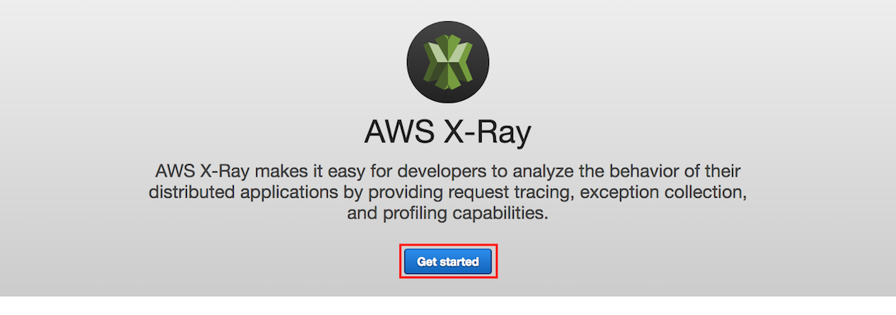

+++
title = "Problem 1: Error Discovery Using X-Ray"
weight = 200
+++
## Problem 1. Error Discovery Using X-Ray

Okay, so your code has a bug.  No problem, let's use AWS X-Ray to investigate!

**Goal:** Use AWS X-Ray to view the Service Map and drill down into the Trace to determine the cause of the error.

<details>
<summary><strong>⬇️ 
HOW TO use AWS X-Ray to locate the code bug (click for details)</strong></summary>
<p>

1. In the AWS Management Console, click **Services** then select **X-Ray** under Developer Tools.

   If this is your first visit to X-Ray, proceed to the next step to navigate the Getting Started page.  Otherwise, skip to Step 4.

1. Click **Get started**

    

1. Click **Cancel**

    

1. The X-Ray Console will open to a Service map that should look similar to the screenshot below:


**Important**
> There can be a slight delay for X-Ray to ingest and process the API calls.  If you don't see the above picture, try refreshing the browser window.


### Service Map

The image shows a client, your browser, connecting to the **AWS::Lambda** resource, which represents the warmup of the Lambda function.  The second connection to the **AWS::Lambda::Function** represents the call to `list.lambda_handler`, which is the handler defined in the `template.yml` template.  The third connection to the **AWS::DynamoDB::Table** represents the queries to the DynamoDB table that persists the Unicorn Stable.

The orange circles around **AWS::Lambda** and **AWS::Lambda::Function** indicates there is an error when making the HTTP calls between these services.


### Traces

1. In the left nav, click on **Traces**.

1. In the **Trace Overview**, note that (in this scenario) there is 1 Error in the list of Responses.  In the **Trace List**, below the **Trace Overview**, click on the first Trace in the list to open the **Trace Detail** page.

   

1. On the **Trace Detail** page, note the **Timeline** of HTTP calls, originating with the API Gateway, but extending to other distributed systems traced by X-Ray.  The Lambda function in the **Trace Detail** listed above the DynamoDB Table has an red warning icon to indicate a **Fault**.

   

1. Click the warning icon to view the Trace **Segment** details (below):

   

1.  In the **Segment Detail**, click the **Exceptions** tab to see the error that was raised and the line of code in `list.js` that caused the error (**line 17** in this example).

1.  Click the **Close** button to close the dialog.
</details>
<p>

Congratulations, you've discovered the error using X-Ray!  Let's locate and fix the bug.


## Problem 1: Resolution

**Goal:** Find and correct the offending Error code in `app/list.js`, then commit and push the code changes to the origin git repository.  Afterwards, use Code Star console to verify successful deployment, and use your browser to confirm the error has been resolved.

<details>
<summary><strong>⬇️ 
HOW TO fix the bug and push code changes (click for details)
</strong></summary>
<p>


### 1. Fix Code Bug

1.  Open the `app/list.js` file in your Cloud9 editor and navigate to the line identified in the X-Ray trace, which should look like the following code snippet:

    ```js
    docClient.scan(params, function(error, data) {
    // Comment or Delete the following line of code to remove simulated error
    err = Error("something is wrong");
    ```

1. Comment or delete this line to fix the code bug

1. Save the `app/list.js` file.


### 2. Commit the change to local Git repository

1. Go to a terminal tab in your Cloud9 IDE and add the local changes to the Git index, and commit with a message.

    ```bash
    git add -u
    git commit -m "Fix bug"
    ```

1. Then push the Git repository updates to the origin.

    ```bash
    git push origin
    ```


### 3. Validate CodePipeline Unicorn API Deployment

After pushing your changes to the CodeStar project's CodeCommit git repository, you will confirm that the changes are build and deployed successfully using CodePipeline.

1. In the AWS Management Console choose **Services** then select **CodeStar** under Developer Tools.

1. Select the `uni-api` project

    

1. Observe that the continuous deployment pipeline on the right of the browser window now shows the Source stage to be blue, meaning that it is active.

    

1. Each stage's color will turn blue during execution and green on completion.  Following the successful execution of all stages, the pipeline should look like the following screenshot.

    

### 4. Excercise Unicorn API List Resource

1. In the AWS Management Console choose **Services** then select **CodeStar** under Developer Tools.

1. Select the `uni-api` project

    

1. Copy the URL from the **Application endpoints** tile on the right side of the dashboard.

    

1. Paste the URL in a browser window and append `/unicorns` to the path and hit enter.  For example: `https://xxxxxxxxxx.execute-api.us-east-1.amazonaws.com/Prod/unicorns/`

1. Your browser should return an error, like the following.  Feel free to refresh your broser several times to register multiple visits to the REST API.

Your browser should no longer return an error.  Refresh your browser several times to register multiple REST API requests.

   ```json
   [ ]
   ```

> if you have added Unicorns to your stable, your results above should return a list of the inventory.

</details>
<p>

The bug has been fixed and the API now responds without error.  Let's use X-Ray to validate your results.


### Validation Using X-Ray

Lets see what the AWS X-Ray traces looks like now that you have removed the error.

**Goal:** Use AWS X-Ray to view the Service Map and verify that the error has been resolved.

<details>
<summary><strong>⬇️ 
HOW TO verify the error has been resolved in X-Ray (click for details)
</strong></summary>
<p>

1. In the AWS Management Console, click **Services** then select **X-Ray** under Developer Tools.  The X-Ray Console will open to a **Service Map** that should look similar to the screenshot below.


**Important**
> There can be a slight delay for X-Ray to ingest and process the API calls.  If you don't see the above picture, try refreshing the browser window after 1-2 minutes.
</details>
<p>

Congratulations!  You've used AWS X-Ray to validate your results.

**BUT NOT SO FAST!**  When you refreshed your browser, did it seem to take a long time to respond?  (Refresh again, if you didn't notice)  Now that the bug has been fixed, there seems to be a performance problem.  Let's use X-Ray to investigate!
