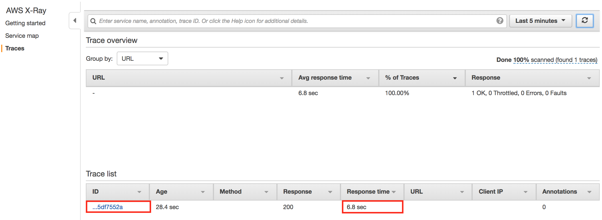
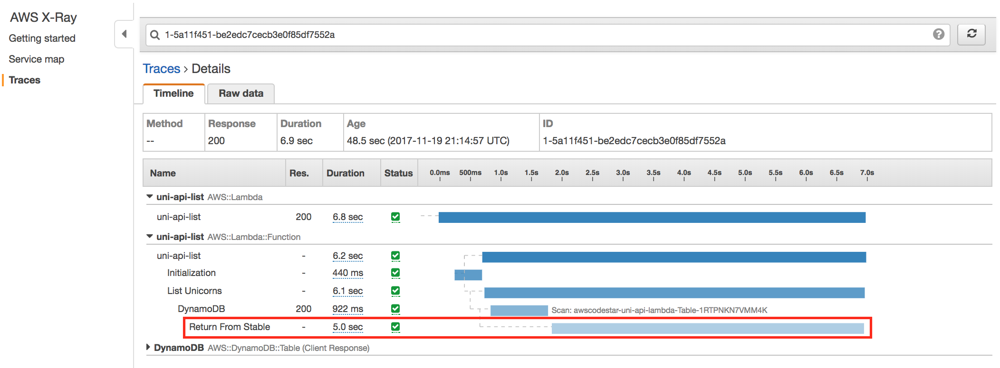
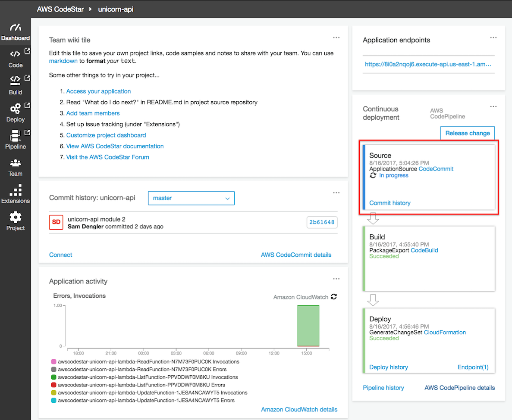

+++
title = "Problem 2: Performance Discovery Using-X-Ray"
weight = 300
+++

## Problem 2. Performance Discovery Using X-Ray

Ok, so your code is a bit slow.  No problem.  By looking in AWS X-Ray traces, we can view the duration of trace segments and subsegments. Let's use AWS X-Ray to see whats going on. 

**Goal:** Using the AWS X-Ray Console, drill down into the X-Ray Traces for the application to identify the delay.

<details>
<summary><strong>⬇️ 
HOW TO use AWS X-Ray to discover the performance delay (click for details)
</strong></summary>
<p>

1. In the AWS Management Console, click **Services** then select **X-Ray** under Developer Tools.

1. In the left navigation, click on **Traces**.

1. In the **Trace list**, notice that **Response time** is 5 seconds or more (6.8 secs in this example).  Click on the first trace.

   

1. On the **Trace Detail** page, note the **Timeline** of HTTP calls, originating with the API Gateway, but extending to other distributed systems traced by X-Ray.  The subsegment in the **Trace Detail** labeled **Return From Stable** has a long timeline indicating a 5 second execution time.  Since the developer used subsegments and labeled them, we can quickly find the part of the code that is causing the delay.

   

</details>
<p>

Next, let's locate and remove the delay!


## Problem 2: Resolution

**Goal:** Find and correct the code causing the delay in `app/list.js`, then commit and push the code changes to the origin git repository. Afterwards, use Code Star console to verify successful deployment, and use your browser to confirm the error has been resolved.

<details>
<summary><strong>⬇️ 
HOW TO fix the code and push the code back up (click for details)
</strong></summary>
<p>


### 1. Fix Code Bug

1.  Open the `app/list.js` file in your Cloud9 editor and find the **Return From Stables** subsegment, which should take you a few lines past the following code snippet:

    ```javascript
    // Comment or Delete the following line of code to remove simulated delay
    const isDelayed = true;

    AWSXRay.captureAsyncFunc('Return From Stables', (subsegment) => {
    ```

1. Comment or delete the line `const isDelayed = true;` to prevent the delay code from running

1. Save the `app/list.js` file.


### 2. Commit the change to local Git repository

1. Go to a terminal tab in your Cloud9 IDE and add the local changes to the Git index, and commit with a message.

    ```bash
    git add -u
    git commit -m "Remove delay"
    ```

1. Push the Git repository updates to the origin.

    ```bash
    git push origin
    ```

### 3. Validate CodePipeline Unicorn API Deployment

After pushing your changes to the CodeStar project's CodeCommit git repository, you will confirm that the changes are build and deployed successfully using CodePipeline.

1. In the AWS Management Console choose **Services** then select **CodeStar** under Developer Tools.

1. Select the `uni-api` project

    

1. Observe that the continuous deployment pipeline on the right of the browser window now shows the Source stage to be blue, meaning that it is active.

    

1. Each stage's color will turn blue during execution and green on completion.  Following the successful execution of all stages, the pipeline should look like the following screenshot.

    


### 4. Excercise Unicorn API List Resource

1. In the AWS Management Console choose **Services** then select **CodeStar** under Developer Tools.

1. Select the `uni-api` project

    

1. Copy the URL from the **Application endpoints** tile on the right side of the dashboard.

    

1. Paste the URL in a browser window and append `/unicorns` to the path and hit enter.  For example: `https://xxxxxxxxxx.execute-api.us-east-1.amazonaws.com/Prod/unicorns/`


Your browser should return an answer much quicker.  Feel free to refresh your browser several times to register multiple REST API requests.

```json
[ ]
```

> if you have added Unicorns to your stable, your results above should return a list of the inventory.

</details>
<p>

The bug has been fixed and the API now responds without delay.  Let's use X-Ray to validate your results!


### Validation Using X-Ray

Lets see what the AWS X-Ray traces looks like now that you have removed the error and the delay.

**Goal:** Use AWS X-Ray to view the Traces and verify that the delay has been resolved.

<details>
<summary><strong>⬇️ 
HOW TO verify the delay has been resolved in X-Ray (click for details)
</strong></summary>
<p>

1. In the AWS Management Console, click **Services** then select **X-Ray** under Developer Tools.

1. In the left navigation, click on **Traces**.

1. In the **Trace list**, notice that **Response time** is much lower.  The first time the function is executed, the duration may be several seconds due to a Lambda cold start penalty, but subsequent executions (via browser) refresh should show sub-second response times.

   

</details>
<p>

Congratulations!  You've used AWS X-Ray to validate your results.

## Completion

You have successfully integrated AWS X-Ray and demonstrated how it can be used to identify errors, latencies, and aid in resolution.
