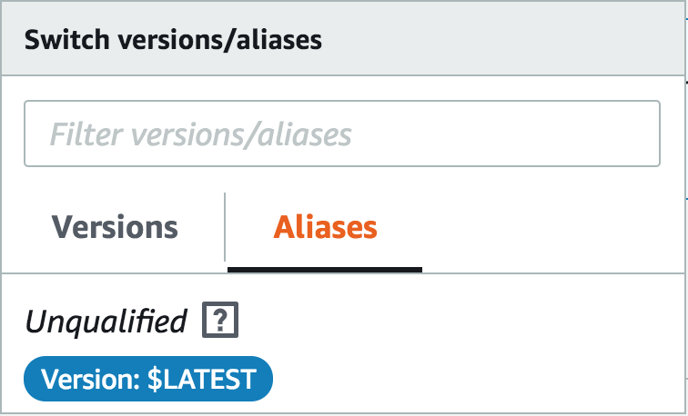
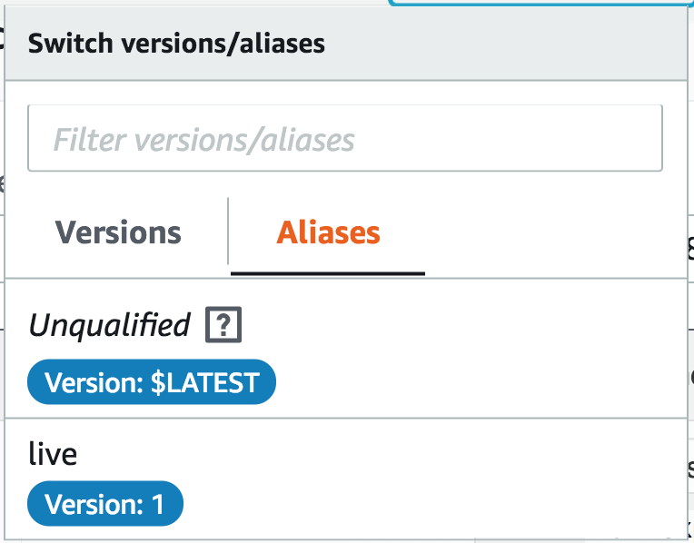

+++
title = "Instant Rollout"
weight = 200
+++

## Instant traffic shifting using Lambda Aliases

Every Lambda function can have any number of *versions* and *aliases* associated with them. Versions are immutable snapshots of a function including code & configuration. If you are familiar with Git, they are similar to commits. In general, it is a good practice to publish a new version every time you update your function code. When you invoke a specific version (using the function name + version number combination) you are guaranteed to get the same code & configuration irrespective of the state of the function. This protects you against accidentally updating production code.

To effectively use the versions, you should create an alias which is literally a pointer to a version. Aliases have a name and an ARN similar to the function and are accepted by the Invoke APIs. If you invoke an alias, AWS Lambda will in turn invoke the version that the alias is pointing to.

In production, you will first update your function code, publish a new version, invoke the version directly to run tests against it, and, after you are satisfied, flip the alias to point to the new version. Traffic will instantly shift from using your old version to using the new version.

SAM provides a simple primitive to do this for you. The `AWS::Serverless::Function` resource can have the following property:

```yml
AutoPublishAlias: <alias-name>
```

## Deploy the AWS Lambda Functions with Versioning

Add the `AutoPublishAlias` property to your function configuration in `template.yml`.


Resources:
  ListFunction:
    Type: 'AWS::Serverless::Function'
    Properties:
      AutoPublishAlias: live


Add, commit, and push your code to the repository now:

```bash
git add template.yml
git commit -m "Auto publish alias"
git push
```


This will:

- Trigger a new run of your pipeline
- Create an alias with `live`
- Create & publish a Lambda version with the latest code & configuration
- Point the alias to the latest published version
- Point all event sources to the alias & not to the function

In other words, your traffic will shift "instantly" to your new code. You can also change your AWS Lambda function's code without affecting other upstream dependencies that rely on the alias.

{}
AutoPublishAlias will publish a new version only when the CodeUri changes. Updates to other configuration (ex: MemorySize, Timeout) etc. will not publish a new version. Hence your alias will continue to point to an old version that uses the old configurations.
{}

After the pipeline has finished inspect the alias of your function in the [AWS Lambda console](https://console.aws.amazon.com/lambda/home#/functions), the name of the Lambda function under consideration is ``uni-api-list``. The configuration was changed as it can be seen with the **Qualifiers** button. It is changed from this alias:

to this:


## Bonus Tasks

1. Take the time and change the output of your application in `list.js` and check the output with your browser before and after you moved the alias.

    <details>
    <summary><strong>⬇️ Solution Hints (click for details)</strong></summary><p>

    - In the AWS Lambda console switch to the **version** "$LATEST".
    - Use Actions->Publish new version to create a new version.
    - Make any code change in your function and save your code.
    - Use Actions->Publish new version to create an other new version
    - Check if your code is visible by using the Amazon API Gateway endpoint as it can be seen in the AWS CodeStar console.
    - Switch to the **alias** "live".
    - Scroll down, change the alias to the latest version, and click save
    - Check again if your code is visible.

    You will observe that the code change is not visible before you move the alias to a new version.
    </p></details>

2. Shift the alias based on weights to another version.

    <details>
    <summary><strong>⬇️ Solution Hints (click for details)</strong></summary><p>

    - In the AWS Lambda console switch to the **alias** "live".
    - Scroll down, change the alias to the latest version.
    - Pick an additional version and enter a weight.
    - Save your settings.
    - Check the output of your API Gateway endpoint. Reload the page multiple times to see the weighting between two versions.
    </p></details>
