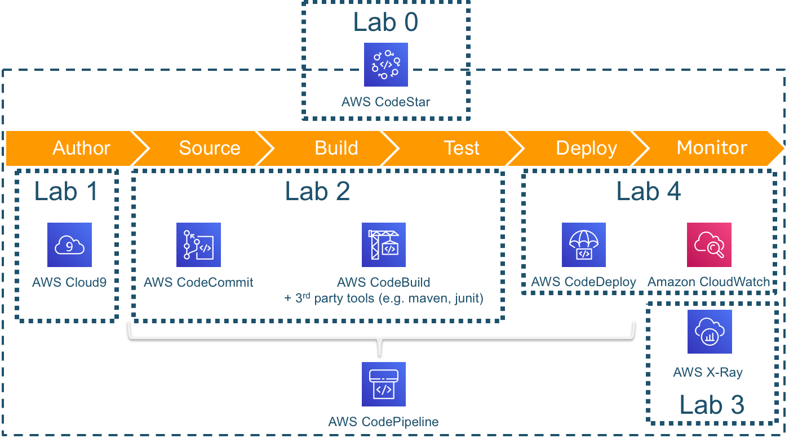

# Continuous Deployment on AWS Workshop

Welcome to the workshop, prepare to get your hands dirty!

The labs of this workshop are aligned with all the phases of the development process.

We'll kickstart your pipeline by using AWS CodeStar in your personal AWS account (Lab 0).

We'll work with an example application. While the continuous deployment practices can be applied to any type of architecture (e.g. on virtual machines, container based), we'll pick a simple serverless application for cost reasons.

We'll spend some time setting up the development environment in AWS Cloud9 and explore ways to test your code locally for fast turnaround cycles in Lab 1. After this, we will extend your build to integrate automatic tests in Lab 2.
In Lab 3 you will use the power of tracing of calls in your application for problem determination. And at last you will learn about ways to deploy safely to production (and rollback if things go south) in Lab 4.

By the end of this workshop, you'll be able to:

- Automate steps of your development and deployment process in a pipeline
- run and test a serverless application locally
- rollout new application versions in a canary deployment
- monitor performance and erros of your application
- stage your application via test and prod environments
- understand the cost components of the solution

And here is what we're going to build:


